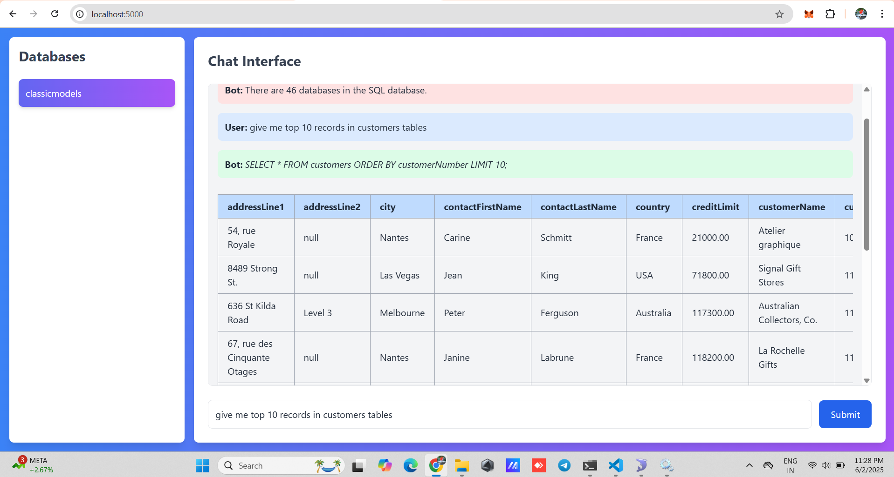
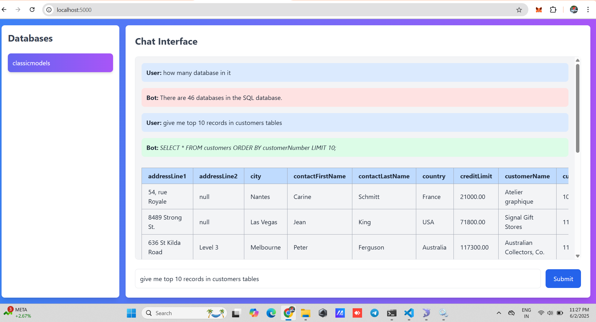

# 🧠 Natural Language to SQL Query Engine using LlamaIndex

This project allows you to input natural language questions and receive SQL queries generated automatically using [LlamaIndex](https://llamaindex.ai/), which leverages an LLM (e.g., OpenAI's GPT models) and your database schema.

---

## 🚀 Features

- Translate natural language questions into SQL queries
- Uses your actual MySQL/PostgreSQL/SQLite database schema
- Powered by LlamaIndex + OpenAI (or other LLMs)
- Plug-and-play with any SQLAlchemy-supported database

---

## 📦 Requirements

- Python 3.8+
- OpenAI API key (or another LLM backend)
- MySQL (or another SQL database)
- Python packages:
  - `llama-index`
  - `sqlalchemy`
  - `pymysql` (for MySQL)
  - `openai`

---

## 🔧 Installation

```bash
pip install llama-index sqlalchemy pymysql openai
```

---

## 🛠️ Configuration

Edit `config.py`:

```python
OPENAI_API_KEY = "your-openai-api-key"
DB_USER = "your_username"
DB_PASSWORD = "your_password"
DB_HOST = "127.0.0.1"
DB_NAME = "your_database"
```

---

## 🧪 Example Usage

```python
from sqlalchemy import create_engine
from llama_index.llms import OpenAI
from llama_index.indices.struct_store.sql_query import SQLDatabaseQueryEngine
from llama_index.indices.struct_store import SQLDatabase
from config import DB_USER, DB_PASSWORD, DB_HOST, DB_NAME, OPENAI_API_KEY
import openai

openai.api_key = OPENAI_API_KEY

# Create SQLAlchemy engine
connection_string = f"mysql+pymysql://{DB_USER}:{DB_PASSWORD}@{DB_HOST}/{DB_NAME}?charset=utf8"
engine = create_engine(connection_string)

# Load SQL database into LlamaIndex
sql_database = SQLDatabase(engine=engine)

# Set up query engine
llm = OpenAI(temperature=0)
query_engine = SQLDatabaseQueryEngine(sql_database=sql_database, llm=llm)

# Ask a question
question = "What are the top 5 customers by revenue?"
response = query_engine.query(question)

# Print result
print("Generated SQL Query:")
print(response.metadata["sql_query"])
print("\nResults:")
print(response)
```

---

## ✅ Sample Output

```text
Generated SQL Query:
SELECT customer_name, SUM(total) AS revenue FROM orders GROUP BY customer_name ORDER BY revenue DESC LIMIT 5;

Results:
customer_name  | revenue
-------------------------
Alice Smith    | 12000
Bob Jones      | 11000
...
```

---

## 💡 Notes

- You can use any LLM backend supported by LlamaIndex.
- Works with MySQL, PostgreSQL, SQLite, etc.
- Use `.metadata["sql_query"]` to access the generated SQL statement directly.

---


## 📂 Project Structure

## 📱 App Preview




## 📄 License

MIT License
